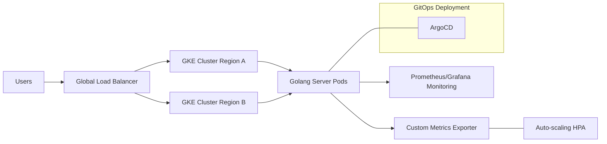

# Part 1: Infrastructure

## Introduction
This repository contains the infrastructure code related to the architecture in GCP to deploy the [Golang server](https://github.com/holdedhub/devops-challenge/blob/master/app/server.go) provided in the challenge with High Availability (HA).

## GCP Architecture


## Application Helm Chart

## Monitoring Stack
The proposed basic monitoring stack is to use Prometheus to collect metrics from the GKE cluster and applications and Grafana to visualize the metrics.

The proposed approach is to use the correcponding Helm charts for Prometheus and Grafana to install them in the cluster. 

> Note: It's not currently implemented in the Golang server but, to allow prometheus to scrape app metrics, we need to explose them in a `/metrics` endpoint. We can use [Prometheus Go client][prom-go-client] to do it.

Prometheus will discover and scrape our application automatically thanks to adding the prometheus annotations:
```yaml
  prometheus.io/scrape: "true"
  prometheus.io/path: "/metrics"
  prometheus.io/port: "8080"
```


## Auto-scaling policies based on custom metrics

To define auto-scaling policies basen on custom metrics or kubernetes resources metrics, we can use the Horizontal Pod Autoscaler (HPA).

The `app-chart` configures the HPA to scale the application based on the CPU, memory and a custom metric `http_requests_per_second`. Once one of the metrics reaches the thresholds defined in the policies, the HPA will scale the application up or down.

To make it possible, it's required to have in the cluster a [Prometheus Adapter][prom-adapter-helm-chart] that exposes our app metrics to Kubernetes via Custom Metrics API. This way, the horizontal pod autoscaler can scale the application based on the custom metric. 

## Complete Architecture



[prom-go-client]: https://github.com/prometheus/client_golang
[prom-helm-chart]: https://artifacthub.io/packages/helm/prometheus-community/prometheus
[prom-adapter-helm-chart]: https://artifacthub.io/packages/helm/prometheus-community/prometheus-adapter