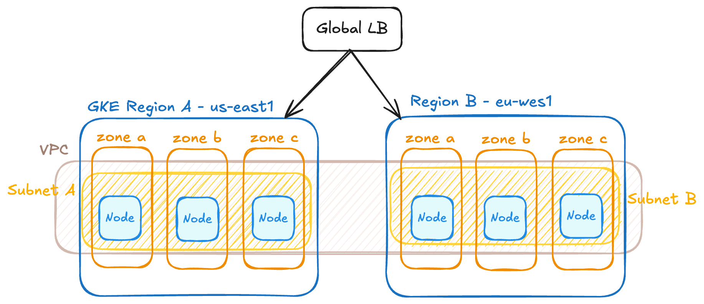

# Part 1: Infrastructure

## Introduction
This directory contains the infrastructure code related to the architecture in GCP to deploy the [Golang server](https://github.com/holdedhub/devops-challenge/blob/master/app/server.go) from the challenge. The architecture is designed with High Availability (HA) in mind, using a multi-region deployment and best practices in Kubernetes resources.

## GCP Architecture

The proposed architecture is to use a multi-region setup deploying two GKE clusters in different regions (`cluster_A` and `cluster_B`) to ensure high availability. The idea is to have a Global Load Balancer in front of the clusters to distribute the traffic between them.  

Within each region, nodes (at least 3) are distributed in different zones to ensure that the application is still available in case of a zone failure. Pods are configured with anti-affinity rule to avoid being scheduled in the same node ([ref](./terraform/app-chart/templates/deployment.yaml)) to ensure that the application is still available in case of a node (or multiple nodes) failure.

For multi-region setup, Google provides [these different options](https://cloud.google.com/kubernetes-engine/docs/concepts/choose-mc-lb-api). I would avoid using the option of provisioning a Global LB along with NEGs as it requires manual configurations. Instead, to make it easier to add new applications to the cluster in the future, I would use the Ingress multicluster or the Gateway API, depending on whether we only need to support HTTPS traffic or not, as the first option is more limited in that regard. These two options are integrated with Kubernets, which makes it easy to automate service discovery and routing.



The resources are deployed in GCP using Terraform and organized into diffrent Terrraform modules for reusability and modularity:
- `gke-cluster`: Deploys a GKE cluster in a specific region. This module uses Helm provider to install base components that are required in the GKE cluster, like the `cert-manager`.
- `networking`: Creates a global VPC network and subnetworks, supporting crossregion reouting and secure connectivity.
- `monitoring`: Deploys Prometheus and Grafana to monitor the clusters and applications.

Within each cluster, the `cert-manager` component is used to manage and issue certificates. In this case we are using a self-signed certificate (see [cert configuration](./terraform/app-chart/templates/cert.yaml)), that allow us to encrypt the traffic but it's not trusted. 

> Note: In a real scenario, we should use a truster certificate authority, such a Let's Encrypt, to issue and renew the certificates.

## Application Helm Chart
The application Kubernete resources are defined in a Helm chart. This approach makes it easier to manage the application resources and configurations in a declarative way. The Helm chart is located in the `app-chart` directory.

## Monitoring Stack
The proposed basic monitoring stack is to use Prometheus to collect metrics from the GKE cluster and applications and Grafana to visualize the metrics.  
To deploy these componene we can use the corresponding Helm chart. 

Prometheus will discover and scrape our application automatically thanks to adding the prometheus annotations:
```yaml
  prometheus.io/scrape: "true"
  prometheus.io/path: "/metrics"
  prometheus.io/port: "8080"
```

> Note: The current Golang server doesn't yer expose metric. To allow prometheus to scrape app metrics, we need to explose them in a `/metrics` endpoint. We can use [Prometheus Go client][prom-go-client] to do it.

## Auto-scaling policies based on custom metrics

To define auto-scaling policies basen on custom metrics or kubernetes resources metrics, we can use the Horizontal Pod Autoscaler (HPA).

The `app-chart` configures the HPA to scale the application based on the CPU, memory and a custom metric `http_requests_per_second`. Once one of the metrics reaches the thresholds defined in the policies, the HPA will scale the application up or down.

To make it possible, it's required to have in the cluster a [Prometheus Adapter][prom-adapter-helm-chart] that exposes our app metrics to Kubernetes via Custom Metrics API. This way, the horizontal pod autoscaler can scale the application based on the custom metric. 

## Future considerations

- Although is not implementes in the current setup, the deployment of the Terraform code should be automated using a CI/CD pipeline to ensure that the infrastructure is always up-to-date and consistent with the code. Terraform state file should be stored in a remote backend (e.g. GCS) to allow collaboration and state locking.

- Terraform modules should be versioned and published to a registry to allow reusability across different projects. Additionally, they should include documentation, examples and tests (using Terratest, for example).

- Move the monitoring stack to a separate cluster to better manage the resources and improve the reliability and metrics access in case one of the regios fails.

- Depending on the requirements of the application and other workloads, we should consider if it's better to use an active-active or active-passive setup on multi-region clusters. In the first case, RTO and RPO are lower but it's more complex to manage and expensive. In the second case, the failover is slower but it's easier to manage and cheaper.

[prom-go-client]: https://github.com/prometheus/client_golang
[prom-helm-chart]: https://artifacthub.io/packages/helm/prometheus-community/prometheus
[prom-adapter-helm-chart]: https://artifacthub.io/packages/helm/prometheus-community/prometheus-adapter