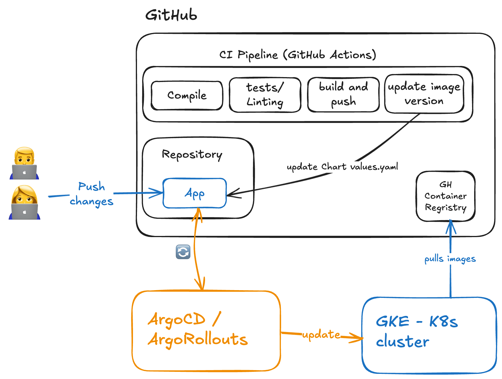

# Application CI/CD

## Introduction
The objective is to create a CI/CD strategy that deploys the Golang server in the GCP environment suporting canary deployments and automated rollback strategies.
The proposed approach is to use GitHub actions to implement for the CI pipeline and ArgoCD, with the ArgoRollouts extension, for the CD part using a GitOps approach.

## Part 1: CI Pipeline
The CI pipeline is defined in a [GitHub workflow](../.github/workflows/ci.yml) and is in charge of:
- Compiling the Golang server.
- Running the tests and linting.
- Building a multi-arch Docker image.
- Pushing the Docker image to the GitHub Container Registry.
- Updating the [app Helm chart values.yaml](../1_infrastructure/terraform/app-chart/values.yaml) with the new image tag whenever a push is made to the `main` branch.

## Part 2: Deployment Strategy

The deployment strategy is based on a GitOps approach using ArgoCD as a continuous deployment tool.   
Since canary deployments and automated rollback strategies are required, the proposed approach is to use ArgoRollouts controller to manage the deployments.

### Argo CD
Our GKE clusters will have ArgoCD installed to manage the deployments. ArgoCD will be in charge of reconciling the desired state (the GitHub repository) with the current state in the GKE cluster after a change is detected. In this case, the change is the image tag update in the app Helm chart `values.yaml` made in the last step of the CI pipeline.

How it works?
- Our repository will contain an ArgoCD application manifest that defines the desired state of the application. Example:
  ```yaml
  apiVersion: argoproj.io/v1alpha1
  kind: Application
  metadata:
    name: my-app
    namespace: argocd
  spec:
    project: default
    source:
      repoURL: https://github.com/carlaurr/challenge.git
      path: 1_infrastructure/terraform/app-chart
      targetRevision: main
      helm:
        valueFiles:
          - values.yaml
    destination:
      server: https://kubernetes.default.svc
      namespace: my-app
    syncPolicy:
      automated:
        prune: true
        selfHeal: true
  ```
- ArgoCD will detect the change in the repository and apply the changes to the GKE cluster.

### Canary Deployments

ArgoCD alone doesn't support canary deployments out of the box. For this, ArgoRollouts controller is used to manage the deployments. It's basically an ArgoCD extension that help us implement more advanced deployment strategies.

ArgoRollouts replaces the standard `Deployments` by `Rollouts`. In our case, the `app-chart/templates/deployment.yaml` file will be updated to use the `Rollout`:

```yaml
apiVersion: argoproj.io/v1alpha1
kind: Rollout
metadata:
  name: {{ .Release.Name }}
  namespace: {{ .Release.namespace }}
spec:
  replicas: 3
  strategy:
    canary:
      steps:
        - setWeight: 25 # 25% to the new version
        - pause: {duration: 60s}
        - setWeight: 50  # 50% to the new version
        - pause: {duration: 120s}
        - setWeight: 75  # 75% to the new version
        - pause: {duration: 180s}
        - setWeight: 100  # 100% to the new version
  selector:
    matchLabels:
      app: {{ .Release.Name }}
  template:
    metadata:
      labels:
        app: {{ .Release.Name }}
    spec:
      containers:
        - name: {{ .Release.Name }}
          image: "{{ .Values.image.repository }}:{{ .Values.image.tag }}"
          ports:
            - containerPort: 8080
```

Apart from that, using ArgoRollouts UI or CLI we can monitor the rollout, see the progress and make a manual promotion or rollback if needed.

### Automated Rollback Strategies
ArgoRollouts will be also used to implement the automated rollback strategies. In case of failure, the rollout will be automatically rolled back to the previous version.
A failure in a new version can be detected using metrics, health checks or Kuberentes probes.

To implement automated rollback strategies for our application, we need to add a new `AnalysisTemplate` in our chart that defines the analysis strategy.  
The proposed strategy is to check the metrics of the new versions, specifically the error rate, and roll back is the error rate is higher than a threshold of 5%. Example:

```yaml
apiVersion: argoproj.io/v1alpha1
kind: AnalysisTemplate
metadata:
  name: error-rate-check
  namespace: {{ .Release.namespace }}
spec:
  metrics:
    - name: error-rate
      interval: 30s
      failureCondition: "result[0] > 0.05"
      failureLimit: 2 
      provider:
        prometheus:
          address: http://prometheus-server.monitoring.svc.cluster.local
          query: |
            sum(rate(http_requests_total{job="my-app",status=~"5.."}[5m])) /
            sum(rate(http_requests_total{job="my-app"}[5m]))
```



## Benefits of the Proposed Approach

- ArgoCD supports multiple cluster contexts. It's possible to manage multiple clusters from a single ArgoCD installation.

- GitOps approach allows us to have a faster recovery time in case of failure.

- Use GitHub actions is easy to manage, configure and extend. If it's required, it's possible to use self-hosted runners for security reasons.

- Audit and track changes is easy as everything is recorded in the repository.
